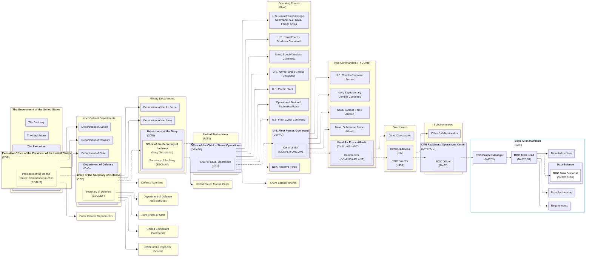

# AJ Averett
***Senior Consultant and Data Engineer***

As a Senior Consultant and Data Engineer at Booz Allen Hamilton, AJ supports critical U.S. Navy aviation readiness initiatives. 

```mermaid
%%{ init: { "theme": "default", "layout": "elk", "look": "neo" } }%%

flowchart LR

 subgraph EOTPs["<b>Executive Office of the President of the United States</b><br>(EOP)"]
        
        POTUS["President of the United States; Commander-in-chief<br>(POTUS)"]
  end
 subgraph EXEC["<b>The Executive</b>"]
        EOTPs
  end
 subgraph GOV["<b>The Government of the United States</b>"]
        EXEC
        LEGIS["The Legislature"]
        JUDIC["The Judiciary"]
        
  end
 subgraph OSD["<b>Office of the Secretary of Defense</b><br>(OSD)"]
        
        SECDEF["Secretary of Defense<br>(SECDEF)"]
  end
 subgraph DOD["<b>Department of Defense</b><br>(DoD)"]
        OSD
        
  end
 subgraph IC["Inner Cabinet Departments"]
        DOS["Department of State"]
        DOT["Department of Treasury"]
        DOD
        DOJ["Department of Justice"]
  end
 subgraph DON["<b>Department of the Navy</b><br>(DON)"]
        
        SECNAV["<b>Office of the Secretary of the Navy</b><br>(Navy Secretariat)<br><br>Secretary of the Navy<br>(SECNAV)"]
  end
 subgraph MD["Military Departments"]
        DOA["Department of the Army"]
        DON
        DAF["Department of the Air Force"]
  end
 subgraph OCNO["<b>Office of the Chief of Naval Operations</b><br>(OPNAV)"]
        
        OCNO2["Chief of Naval Operations<br>(CNO)"]
  end
 subgraph NAVY["<b>United States Navy</b><br>(USN)"]
        OCNO
        
  end
 subgraph USFFC["<b>U.S. Fleet Forces Command</b><br>(USFFC)"]
        
        USFFC2["Commander<br>(COMFLTFORCOM)"]
  end
 subgraph OF["Operating Forces<br>(Fleet)"]
        USFFC
        USPACFLT["U.S. Pacific Fleet"]
        NAVCENT["U.S. Naval Forces Central Command"]
        USNAVSO["U.S. Naval Forces Southern Command"]
        NAVEUR-NAVAF["U.S. Naval Forces Europe, Command, U.S. Naval Forces Africa"]
        NAVSPECWARCOM["Naval Special Warfare Command"]
        OPTEVFOR["Operational Test and Evaluation Force"]
        USNR["Navy Reserve Force"]
        COMCYBER["U.S. Fleet Cyber Command"]
  end
 subgraph AIRLANT["<b>Naval Air Force Atlantic</b><br>(CNAL; AIRLANT)"]
        
        AIRLANT2["Commander (COMNAVAIRLANT)"]
  end
 subgraph TYCOM["Type Commanders (TYCOMs)"]
        AIRLANT
        SUBLANT["Naval Submarine Force Atlantic"]
        SURFLANT["Naval Surface Force Atlantic"]
        NECC["Navy Expeditionary Combat Command"]
        NAVIFOR["U.S. Naval Information Forces"]
  end
 subgraph DIR["Directorates"]
        CVNMM["<b>CVN Readiness</b><br>(N43)<br><br>ROC Director<br>(N43A)"]
        DIR2["Other Directorates"]
  end
 subgraph N43["<b>CVN Readiness Operations Center </b><br>(CVN ROC)"]
        
        ROC_a["ROC Officer<br>(N437)"]
  end
 subgraph boozDS["<b>Data Science</b>"]
        ROC_d["<b>ROC Data Scientist</b><br>(N437E.9110)"]
  end
 subgraph booz["<b>Booz Allen Hamilton</b><br>(BAH)"]
        
        boozDS
        ROC_b["<b>ROC Project Manager</b><br>(N437R)"]
        ROC_c["<b>ROC Tech Lead</b><br>(N437E.91)"]
        boozDE["Data Engineering"]
        boozDA["Data Architecture"]
        boozREQ["Requirements"]
  end
 subgraph DIR_sub["Subdirectorates"]
        N43
        DIR3["Other Subdirectorates"]
  end
    EXEC --> DOS & DOT & DOD & DOJ & Dother["Outer Cabinet Departments"]
    OSD --> DefA["Defense Agencies"] & FieldAct["Department of Defense Field Activities"]
    DOD --> DOA & DON & DAF & JCoS["Joint Chiefs of Staff"] & UCC["Unified Combatant Commands"] & OIG["Office of the Inspector General"]
    DON --> USMC["United States Marine Corps"] & NAVY
    OCNO L_OCNO_USFFC_0@--> USFFC & USPACFLT & NAVCENT & USNAVSO & NAVEUR-NAVAF & NAVSPECWARCOM & OPTEVFOR & USNR & COMCYBER & SHORE["Shore Establishments"]
    USFFC L_USFFC_AIRLANT_0@--> AIRLANT & SUBLANT & SURFLANT & NECC & NAVIFOR
    AIRLANT L_AIRLANT_CVNMM_0@--> CVNMM & DIR2
    ROC_b L_ROC_b_ROC_c_0@--> ROC_c
    ROC_c L_ROC_c_ROC_d_0@--> ROC_d & boozDE & boozDA & boozREQ
    CVNMM L_CVNMM_N43_0@--> N43
    N43 L_N43_ROC_b_0@--> ROC_b
    DIR --> DIR3
    style POTUS stroke:#FFFFDE, fill:#FFFFDE  
    style EXEC fill:#ECECFF
    style SECDEF stroke:#FFFFDE, fill:#FFFFDE
    style DOD fill:#ECECFF
    style SECNAV fill:#FFFFDE
    style DON fill:#ECECFF
    style OCNO2 stroke:#ECECFF, fill:#ECECFF
    style OCNO fill:#ECECFF
    style USFFC2 stroke:#ECECFF
    style USFFC fill:#ECECFF
    style AIRLANT2 stroke:#ECECFF
    style AIRLANT fill:#ECECFF
    style ROC_a fill:#ECECFF, stroke:#ECECFF
    style ROC_d fill:#FFFFFF
    style boozDS fill:#ECECFF
    style N43 fill:#ECECFF
    style DIR3 fill:#ECECFF
    style Dother fill:#FFFFDE
    style DefA fill:#FFFFDE
    style FieldAct fill:#FFFFDE
    style JCoS fill:#FFFFDE
    style UCC fill:#FFFFDE
    style OIG fill:#FFFFDE
    style USMC fill:#FFFFDE
    style SHORE fill:#FFFFDE
    style booz fill:#FFFFFF, stroke:#23D2D7
    L_EXEC_DOD_0@{ animation: fast } 
    L_DOD_DON_0@{ animation: fast } 
    L_DON_NAVY_0@{ animation: fast } 
    L_OCNO_USFFC_0@{ animation: fast } 
    L_USFFC_AIRLANT_0@{ animation: fast } 
    L_AIRLANT_CVNMM_0@{ animation: fast } 
    L_ROC_b_ROC_c_0@{ animation: fast } 
    L_ROC_c_ROC_d_0@{ animation: fast } 
    L_CVNMM_N43_0@{ animation: fast } 
    L_N43_ROC_b_0@{ animation: fast }
```
